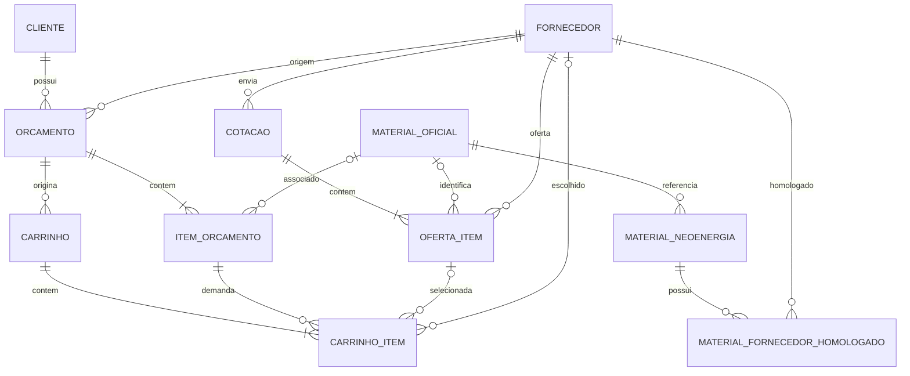

# DER — Sistema de Orçamentos 3P

## Diagrama principal



## Leitura simplificada

```text
CLIENTE
  │
  └──< ORCAMENTO
          │
          └──< ITEM_ORCAMENTO
                    │
                    └──> MATERIAL_OFICIAL
                              │
                              └──< MATERIAL_NEOENERGIA
                                         │
                                         └──< MATERIAL_FORNECEDOR_HOMOLOGADO
                                                      │
                                                      └──> FORNECEDOR
```

A parte comercial:

```text
FORNECEDOR
   │
   └──< COTACAO
           │
           └──< OFERTA_ITEM
                     │
                     └──> MATERIAL_OFICIAL
```

A otimização:

```text
ORCAMENTO
   │
   └──< CARRINHO
           │
           └──< CARRINHO_ITEM
                     │
                     ├──> ITEM_ORCAMENTO
                     ├──> OFERTA_ITEM
                     └──> FORNECEDOR
```

## Entidades

### Cliente

Representa o cliente do orçamento.

### Orçamento

Representa o documento/processo comercial importado.

### Item do orçamento

Representa cada linha/material recebido.

Mantém:

- descrição original;
- descrição normalizada;
- quantidade;
- unidade;
- preço;
- resultado do matching.

### Material oficial

Identidade canônica usada para comparar descrições diferentes.

Exemplo:

```text
CABO COBRE FLEXIVEL 10 MM2 0.6/1 KV
```

### Material Neoenergia

Referência importada dos catálogos Neoenergia.

Pode ter origem:

```text
NEOENERGIA_REDE
NEOENERGIA_SUBESTACOES
```

### Material × Fornecedor Homologado

Resolve a relação N:N.

Um material pode ter vários fornecedores homologados.

Um fornecedor pode estar homologado para vários materiais.

### Fornecedor

Cadastro único de fornecedor.

### Cotação

Cabeçalho de uma proposta comercial de fornecedor.

### Oferta Item

Preço e condições oferecidas para determinado material.

Essa entidade é essencial para o futuro carrinho otimizado.

### Carrinho

Representa uma execução da otimização para um orçamento.

### Carrinho Item

Registra a oferta selecionada para cada item.

## Cardinalidades importantes

| Entidade A | Relação | Entidade B |
|---|---|---|
| Cliente | 1:N | Orçamento |
| Orçamento | 1:N | Item |
| Item | N:1 opcional | Material Oficial |
| Material Oficial | 1:N | Material Neoenergia |
| Material Neoenergia | N:N | Fornecedor |
| Fornecedor | 1:N | Cotação |
| Cotação | 1:N | Oferta |
| Material Oficial | 1:N | Oferta |
| Orçamento | 1:N | Carrinho |
| Carrinho | 1:N | Carrinho Item |

## Observação importante

O DER representa o **modelo alvo**.

Ele não significa que todas as Lists atuais do SharePoint devam ser migradas imediatamente.

A adoção deve ser gradual.
